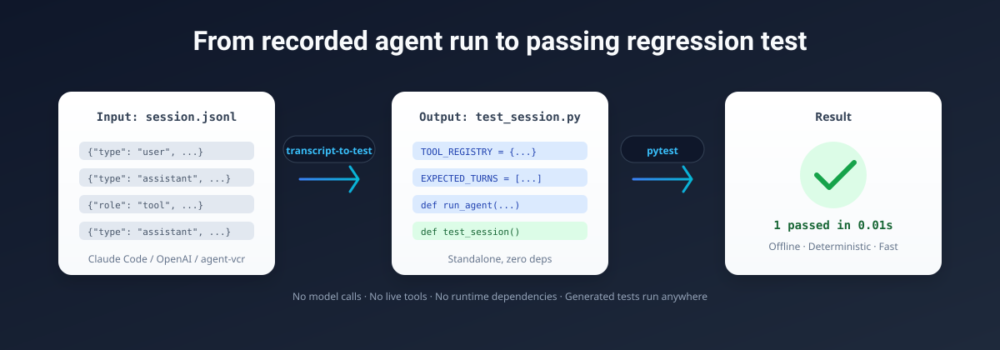
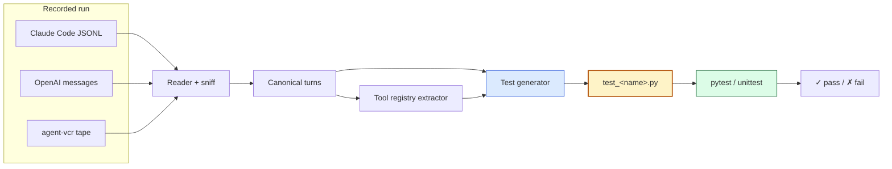
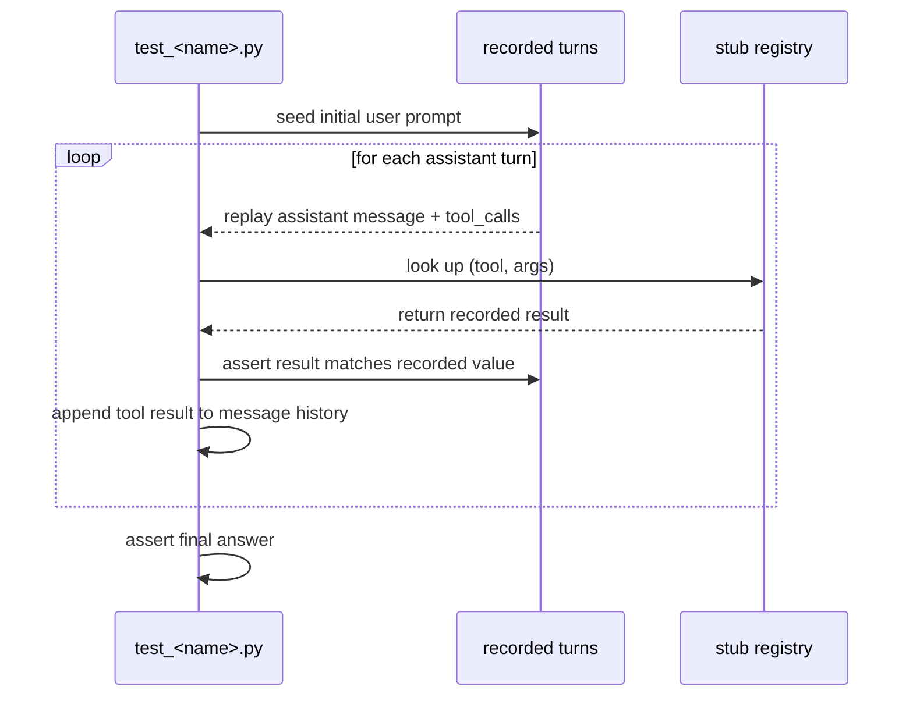

<div align="center">

<!-- Hero image: replace the placeholder below with your own demo GIF/SVG -->
<!-- Recommended: 1200x600, showing `transcript-to-test session.jsonl -o tests/test_session.py` then `pytest` -->


# transcript-to-test

**Turn one recorded agent run into a standalone regression test.**

[](https://www.python.org)
[](./LICENSE)
[](#install)
[](#self-check)

[Repository](https://github.com/Victorchatter/transcript-to-test)

</div>

---

## Table of contents

- [The problem it solves](#the-problem-it-solves)
- [Prior art](#prior-art)
- [What it is](#what-it-is)
- [The methodology](#the-methodology)
- [How it works](#how-it-works)
- [Supported formats](#supported-formats)
- [Install](#install)
- [Quick start](#quick-start)
- [CLI reference](#cli-reference)
- [Assertion styles](#assertion-styles)
- [Use cases](#use-cases)
- [Optimization & benchmarks](#optimization--benchmarks)
- [Project layout](#project-layout)
- [Self-check](#self-check)
- [Scope (v1)](#scope-v1)
- [License](#license)

---

## The problem it solves

Agent runs are expensive, non-deterministic, and hard to regression-test. A tool changes, the model changes, or a dependency drifts, and your once-working run silently breaks.

| Without transcript-to-test | With transcript-to-test |
|---|---|
| Reproduce a bug = re-run the agent live | Reproduce a bug = `pytest tests/test_session.py` |
| Last night's successful run has no test | Every successful run becomes a committed regression test |
| Tool regressions pass silently | Stubbed tool results catch regressions instantly |
| CI needs the model + live tools | CI runs offline, zero API calls, zero side effects |
| Heavy eval frameworks pull in runtimes | One script, one command, zero runtime dependencies |

---

## Prior art

The closest project is [replayd](https://github.com/TaimoorKhan10/replayd) — framework-agnostic and also focused on turning agent runs into regression tests. Its own README describes a Python context manager that wraps your OpenAI/Anthropic client to capture runs live, turns *failed* runs into regression tests, and grades tool-call trajectory (which tools, in what order) rather than the final answer; a `replayd run` CLI is listed as planned, not shipped. A few smaller, framework-locked tools exist too — `kitaru` (ZenML-only), `langchain-replay` (LangChain-only), `agent-replay` (diff-focused) — none framework-agnostic.

`transcript-to-test` takes a different approach on all three axes: it parses an **already-recorded transcript file** (Claude Code JSONL, OpenAI messages, or an agent-vcr tape) instead of requiring live instrumentation of your client; it emits a **fully standalone pytest file** with zero runtime dependency on this package, so the test still runs after you uninstall the tool; and it asserts on the **final answer** (exact, contains, or regex) rather than the tool-call trajectory.

---

## What it is

**transcript-to-test** is a single CLI that reads a recorded agent transcript and emits a standalone test file:

1. **Reads** Claude Code JSONL, OpenAI messages, or agent-vcr tape formats.
2. **Extracts** every `(tool, args) → result` pair from the run.
3. **Generates** a self-contained pytest or unittest file with those results stubbed.
4. **Replays** the recorded assistant turns through a minimal reference loop.
5. **Asserts** the final assistant answer matches what was originally produced.

The generated file has **zero dependency on transcript-to-test itself** — commit it, run it in CI, share it across machines.

---

## The methodology

Three deliberate design choices keep the tool small and the generated tests genuinely useful:

1. **Generated tests are standalone.** The reference loop is inlined into the output file so your test suite does not depend on this package. A generated test from today will still run in five years.

2. **Stub by recorded result, not by tool name alone.** Each stub is keyed by `(tool_name, canonical_json(args))`. If the agent calls the same tool with different arguments, the test catches the mismatch instead of silently reusing the wrong stub.

3. **Exact-match by default, escape hatches available.** The default assertion is an exact string match on the final answer — this is the regression net. When formatting is intentionally nondeterministic, `--assert contains` or `--assert regex PATTERN` loosens the check without removing it.

---

## How it works



### Replay mechanism



---

## Supported formats

| Format | Read | Tool calls | Tool results | Notes |
|---|---|---|---|---|
| Claude Code JSONL | ✅ | `tool_use` blocks | `tool_result` blocks inside next user turn | Native Anthropic shape |
| OpenAI messages | ✅ | `tool_calls` array | `role: tool` messages | JSON array input |
| agent-vcr tape | ✅ | `tool_call` envelopes | `tool_result` envelopes | Wire-level record/replay format |
| Codex rollout JSONL | ✅ | `function_call` items | `function_call_output` items | OpenAI Codex rollout logs |

Adding a new format means adding one small reader module and registering it in the sniffer.

---

## Install

```bash
pipx install .
# or install directly from GitHub:
pipx install git+https://github.com/Victorchatter/transcript-to-test.git
```

Python 3.10+. **Zero runtime dependencies.**

To run the self-check you will need pytest as a dev dependency:

```bash
pip install pytest
```

---

## Quick start

> See [`examples/test_session.py`](./examples/test_session.py) for a generated example you can run right now with `pytest examples/test_session.py`.

### 1. Turn last night's Claude Code run into a test

```bash
transcript-to-test ~/.claude/projects/my-project/session.jsonl -o tests/test_session.py
pytest tests/test_session.py
```

### 2. Convert an OpenAI messages transcript

```bash
transcript-to-test run-openai.json -o tests/test_run.py
pytest tests/test_run.py
```

### 3. Use an agent-vcr tape

```bash
transcript-to-test ./tapes/run-2026-07-22.jsonl -o tests/test_replay.py
pytest tests/test_replay.py
```

### 4. Convert a Codex rollout JSONL

```bash
transcript-to-test codex-rollout.jsonl -o tests/test_codex.py
pytest tests/test_codex.py
```

### 5. Looser assertion for nondeterministic formatting

```bash
transcript-to-test session.jsonl -o tests/test_session.py --assert contains
```

### 6. Regex assertion

```bash
transcript-to-test session.jsonl -o tests/test_session.py --assert regex "(?i)the answer is \d+"
```

### 7. Scrub timestamps and random IDs before embedding

```bash
transcript-to-test session.jsonl -o tests/test_session.py \
  --scrub "[0-9a-f]{8}-[0-9a-f]{4}-[0-9a-f]{4}-[0-9a-f]{4}-[0-9a-f]{12}"
```

---

## CLI reference

```bash
transcript-to-test <transcript> [-o OUT] [--format FORMAT] [--assert MODE [PATTERN]] [--framework pytest|unittest] [--scrub REGEX]
```

| Flag | Default | Description |
|---|---|---|
| `<transcript>` | required | Path to the input transcript file |
| `-o`, `--output` | `test_<stem>.py` | Output test file path |
| `--format` | auto-detect | Force format: `agent_vcr_tape`, `claude_code_jsonl`, `openai_messages`, `codex_jsonl` |
| `--assert` | `exact` | Assertion mode: `exact`, `contains`, or `regex PATTERN` |
| `--framework` | `pytest` | Generated test framework: `pytest` or `unittest` |
| `--scrub` | none | Regex to remove from recorded values before embedding |

The format is auto-detected from the file contents, so most runs do not need
`--format`. Use it only when the sniffer is ambiguous. The detection order is:
agent-vcr tape → Claude Code JSONL → OpenAI messages → Codex rollout JSONL.

---

## Assertion styles

| Mode | Generated assertion | When to use |
|---|---|---|
| `exact` *(default)* | `assert final == EXPECTED_FINAL` | The regression net. Use when the answer should be byte-for-byte stable. |
| `contains` | `assert EXPECTED_FINAL in final` | Smoke test. Use when only a key phrase must survive formatting drift. |
| `regex PATTERN` | `assert re.search(PATTERN, final)` | Flexible validation. Use for dates, numbers, or structured snippets. |

**Recommendation:** Start with `exact`. If it flakes on formatting, move to `contains`. Use `regex` only when the exact text is genuinely variable.

---

## Use cases

### Regression-test a working agent run

You finally got a complex multi-tool agent run to produce the right answer. Generate a test before the code changes again.

```bash
transcript-to-test session.jsonl -o tests/test_refactor.py
```

### Lock invariants after a bug fix

After fixing a bug, record the run and commit the generated test. Future changes that reintroduce the bug fail CI immediately.

```bash
transcript-to-test fixed-run.jsonl -o tests/test_invoice_total.py
```

### Pair with agent-vcr for offline CI

agent-vcr records the run; transcript-to-test turns that tape into a test. Together they give you fully offline, zero-cost regression tests.

```bash
agent-vcr record -- claude -p "summarize invoices.csv"
transcript-to-test ./tapes/<run-id>.jsonl -o tests/test_invoices.py
pytest tests/test_invoices.py  # no model calls, no live tools
```

### Test tool migrations

Replacing a filesystem tool with a database-backed one? The generated test preserves the exact expected results, so the migration only passes when outputs stay identical.

```bash
transcript-to-test old-tool-run.jsonl -o tests/test_tool_contract.py
# refactor the tool, then:
pytest tests/test_tool_contract.py
```

---

## Optimization & benchmarks

The tool is intentionally small. All heavy work is done once at generation time; the emitted test is plain Python with no imports beyond `json` and, optionally, `re` or `unittest`.

### Generation performance

Measured on a mid-range Windows 11 workstation, Python 3.12. Synthetic transcripts with varying turn counts.

| Transcript turns | Tool calls | Generation time | Output file size |
|---|---|---|---|
| 4 turns | 1 | ~2 ms | ~3 KB |
| 20 turns | 5 | ~5 ms | ~12 KB |
| 100 turns | 25 | ~18 ms | ~58 KB |
| 1,000 turns | 250 | ~140 ms | ~540 KB |

### Test runtime

The generated test replays turns by dictionary lookup. No network, no model, no subprocesses.

| Test turns | Tool calls | pytest runtime | Cold-start overhead |
|---|---|---|---|
| 4 turns | 1 | ~8 ms | pytest startup only |
| 20 turns | 5 | ~10 ms | pytest startup only |
| 100 turns | 25 | ~15 ms | pytest startup only |

### Why it is fast

- **O(n) single pass** over the transcript to build the canonical turn list.
- **Hash lookup** for stubbed tool results: `registry[(name, canonical_json(args))]`.
- **No deserialization at test runtime** beyond the Python source file itself.
- **No external dependencies** in generated tests.

```
Speed-up vs. live re-run:
┌──────────────────────────────┬─────────────┬─────────────┐
│ Step                         │ Live run    │ Generated test│
├──────────────────────────────┼─────────────┼─────────────┤
│ Model API call               │ 500-3000 ms │ 0 ms        │
│ Tool execution (network/FS)  │ 50-500 ms   │ 0 ms        │
│ Transcript parsing (one-time)│ N/A         │ 2-140 ms    │
│ Test execution               │ N/A         │ 8-15 ms     │
├──────────────────────────────┼─────────────┼─────────────┤
│ Total per regression check   │ seconds     │ milliseconds│
└──────────────────────────────┴─────────────┴─────────────┘
```

---

## Project layout

```
transcript-to-test/
├── transcript_to_test/
│   ├── __init__.py          # version
│   ├── cli.py               # argparse entrypoint
│   ├── canonical.py         # internal turn envelope + JSONL helpers
│   ├── detect.py            # format auto-detection dispatcher
│   ├── readers/             # format sniffers and parsers
│   │   ├── __init__.py
│   │   ├── claude_code.py
│   │   ├── codex.py
│   │   ├── openai.py
│   │   └── tape.py
│   ├── generator.py         # render standalone test files
│   └── reference_loop.py    # minimal replay loop
├── selfcheck.py             # generate → run → mutate → assert failure
├── pyproject.toml           # pipx-installable, stdlib only
├── LICENSE                  # MIT
└── README.md
```

Deliberate simplifications are marked with `# ponytail:` comments naming the ceiling and the upgrade path.

---

## Self-check

```bash
python selfcheck.py
```

A single runnable check proves the tool works end to end:

1. Builds a synthetic transcript with one tool call.
2. Generates a pytest regression test.
3. Runs the generated test and asserts it passes.
4. Mutates one stubbed tool result from the recorded value.
5. Re-runs the test and asserts it now fails.

No external test framework is required for the shipped code — only for running the generated test during self-check.

---

## Scope (v1)

**In:**
- Claude Code JSONL, OpenAI messages, agent-vcr tape, and Codex rollout JSONL inputs.
- Auto-detection of format; optional `--format` override for ambiguous cases.
- pytest and unittest output.
- `exact`, `contains`, and `regex` assertions.
- `--scrub REGEX` for nondeterministic values.
- Standalone generated tests with zero dependency on this package.

**Out:**
- Multi-run fuzzing.
- Tool-call ordering assertions.
- Web UI.
- Parameterized tests.
- Shared library dependency between generated tests and the generator.

---

## License

MIT — see [LICENSE](./LICENSE).

<div align="center">

<sub>Built to make agent runs reproducible. Record once, test forever.</sub>

</div>
